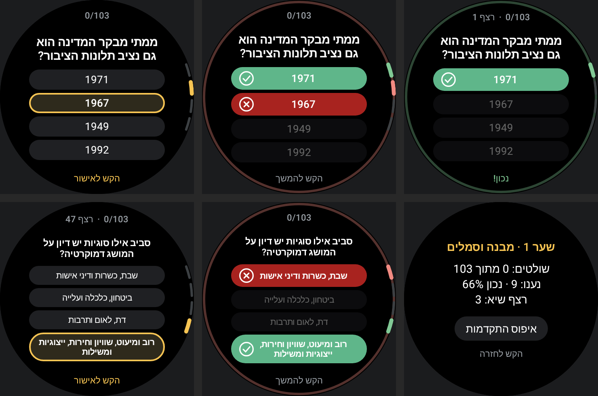

# אלוף המקראות – שער 1 (Wear OS)

An endless multiple-choice quiz for the round watch, made to practise the first gate of
**מקראות ישראל** (Bahad 1): *מדינת ישראל – מבנה וסמלים*. It is a separate app from Orbit
(`com.albustech.mikraot`), standalone, and needs no phone or network.

## How it fits the circle



```
         ╭──────── 37/103 · רצף 4 ────────╮     top cap: mastered / total, streak
        │      מי עיצב את סמל המדינה?      │    question, sized to fit
        │   ( דוד וולפסון               )  ▪│
        │   ( גבריאל ומקסים שמיר         ) ▮│    the lit answer opens to full text
        │   ( נפתלי הרץ אימבר            ) ▪│    (up to 3 lines); others stay 1 line.
        │   ( בוריס שץ                  )  ▪│    notches on the right = bezel position
         ╰────────── הקש לאישור ───────────╯     bottom cap: what to do next
```

- **Bezel**: one click moves to the next answer (wraps around). After answering, a click
  moves to the next question.
- **Tap**: confirms the lit answer. Tapping a pill lights it; tapping it again answers.
- **Right**: green rim and pill, a confirm buzz, and the next question after a moment.
- **Wrong**: your pick turns red and the right answer green. It stays until you tap or turn,
  so you can read it.
- **Long press**: stats (mastered, accuracy, best streak) and a two-tap reset.

Text is sized once per question so that the worst case still fits: the question plus all four
answers with two of them open (yours and the right one). Long questions get smaller text
instead of being cut off.

## Learning loop

Each round asks every question once, with the ones not yet mastered first. A miss returns
after three other questions. Two right answers in a row mark a question as mastered. Progress
is saved after every answer.

## Questions

There are 103 questions in `src/main/java/com/albustech/mikraot/Questions.kt`, with the right
answer listed first (the app shuffles the order). The right answers follow the Gate 1 study
Q&A at [bhdone.wordpress.com/home/shaar1](https://bhdone.wordpress.com/home/shaar1/). The
three wrong options are written for this app. The real *אלוף המקראות* app's question bank is
not public, so these are not its questions.

One answer follows the book, not today's law: the book counts **11** Basic Laws. Laws passed
since then (Referendum 2014, Nation-State 2018) bring the count to 13.

## Build and install

```sh
./gradlew :quiz:assembleDebug          # quiz/build/outputs/apk/debug/quiz-debug.apk
./gradlew :quiz:installDebug           # with the watch connected over ADB (see the main README)
./gradlew :quiz:testDebugUnitTest      # unit tests + screenshots in quiz/build/screenshots/
```
